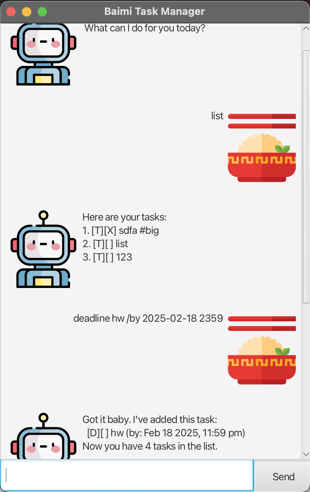

# Baimi User Guide



## Introduction
Baimi is a simple task management application that helps you organize your to-do lists efficiently. It supports different types of tasks, including general to-dos, deadlines, and events. Baimi features both a CLI and GUI interface, allowing users to manage tasks conveniently.

## Features

### Adding a To-Do Task
To add a to-do task, use the `todo` command followed by the task description.

**Example:**  
```
todo Read a book
```

**Expected Output:**  
```
Got it. I've added this task:
  [T][ ] Read a book
Now you have 1 task in the list.
```

### Adding a Deadline
To add a deadline task, use the `deadline` command followed by the task description and the due date in `YYYY-MM-DD HHMM` format.

**Example:**  
```
deadline Submit assignment /by 2025-02-20 2359
```

**Expected Output:**  
```
Got it. I've added this task:
  [D][ ] Submit assignment (by: 2025-02-20 23:59)
Now you have 2 tasks in the list.
```

### Adding an Event
To add an event, use the `event` command followed by the event description, start time, and end time in `YYYY-MM-DD HHMM` format.

**Example:**  
```
event Team meeting /from 2025-02-22 1400 /to 2025-02-22 1600
```

**Expected Output:**  
```
Got it. I've added this task:
  [E][ ] Team meeting (from: 2025-02-22 14:00 to: 2025-02-22 16:00)
Now you have 3 tasks in the list.
```

### Listing Tasks
To view the list of all tasks, use the `list` command.

**Example:**  
```
list
```

**Expected Output:**  
```
Here are the tasks in your list:
1. [T][ ] Read a book
2. [D][ ] Submit assignment (by: 2025-02-20 23:59)
3. [E][ ] Team meeting (from: 2025-02-22 14:00 to: 2025-02-22 16:00)
```

### Marking a Task as Done
To mark a task as done, use the `mark` command followed by the task number.

**Example:**  
```
mark 1
```

**Expected Output:**  
```
Nice! I've marked this task as done:
  [T][X] Read a book
```

### Unmarking a Task
To unmark a task (mark it as not done), use the `unmark` command followed by the task number.

**Example:**  
```
unmark 1
```

**Expected Output:**  
```
OK, I've marked this task as not done yet:
  [T][ ] Read a book
```

### Deleting a Task
To delete a task, use the `delete` command followed by the task number.

**Example:**  
```
delete 2
```

**Expected Output:**  
```
Noted. I've removed this task:
  [D][ ] Submit assignment (by: 2025-02-20 23:59)
Now you have 2 tasks in the list.
```

### Exiting the Application
To exit the application, use the `bye` command.

**Example:**  
```
bye
```

**Expected Output:**  
```
Bye! Hope to see you again soon!
```

## Error Handling
Baimi provides informative error messages for invalid commands.

**Example of Invalid Command:**  
```
delete 100
```

**Expected Output:**  
```
OOPS!!! Task number is out of range. Please enter a valid task number between 1 and 3.
```

## Storage
Baimi automatically saves your tasks in `./data/baimi.txt` and reloads them upon restarting.

## Conclusion
Baimi is a lightweight and efficient task manager for CLI users. Try it out and boost your productivity!

